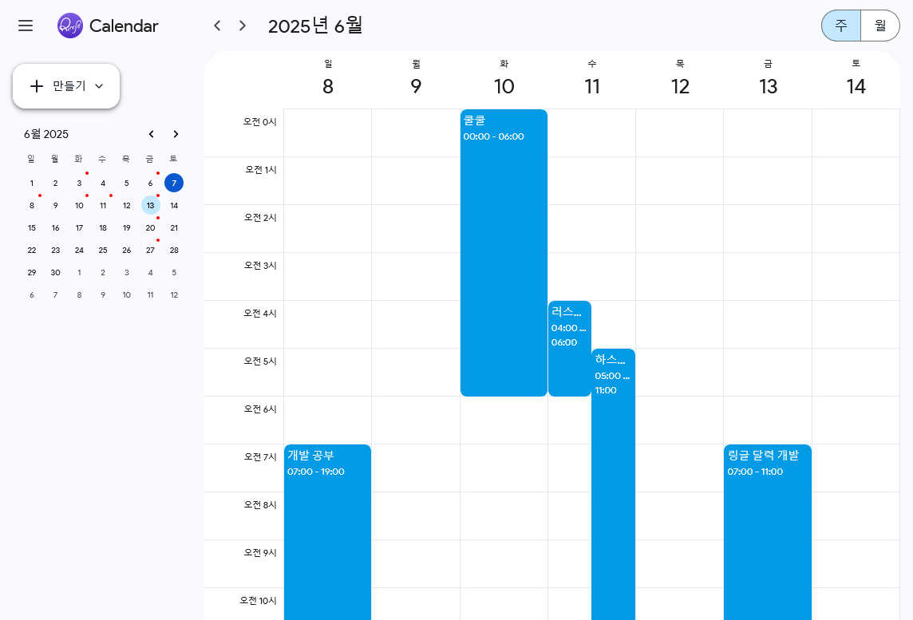

# ringle-calendar

> 안녕하세요, FE 인턴에 지원한 송준영입니다. 과제를 개발하는 경험이 정말 즐거웠고, 응시할 기회를 주신 것에 정말 감사드립니다. 😊

## 소개



Google 캘린더 클론 앱.

## 시작하기

1. **Cloudflare Pages**: [ringle-calendar.pages.dev](https://ringle-calendar.pages.dev)

2. **로컬로 실행**:
```bash
$ git clone https://github.com/jysongbiz/ringle-calendar
$ cd ringle-calendar
$ yarn && yarn run dev
```

## 기술 스택
- **TypeScript & React**
- **Vite**
- **CSS in JS (Chakra UI)**
- **Redux & Toolkit**

## 디렉토리 상세
```
ringle-calendar/
└── src/
    ├── components/
    │   ├── ui/
    │   │   ├── Sidebar.tsx           # 사이드바
    │   │   ├── RootLayout.tsx        # 루트 레이아웃
    │   │   ├── Header.tsx            # 내비게이션 헤더
    │   │   ├── Providers.tsx         # 프로바이더
    │   │   ├── LetThereBeLight.tsx   # scheme light로 고정
    │   │   └── index.ts
    │   ├── DatePicker.tsx            # 작은 달력
    │   ├── AddModal.tsx              # 이벤트 추가 모달
    │   └── EventItem.tsx             # 이벤트 아이템
    │
    ├── views/                        # 페이지 컴포넌트
    │   ├── MonthView.tsx             # 월별 보기
    │   └── WeekView.tsx              # 주별 보기
    │
    ├── store/                        # Redux store
    │   ├── index.ts                  # store 설정
    │   ├── types.ts                  # 타입 정의
    │   ├── calendarSlice.ts          # 캘린더 상태 (이벤트)
    │   └── modalSlice.ts             # 모달 상태 (생성 & 수정)
    │
    ├── hooks/
    │   ├── useCalendarEvents.ts      # 이벤트 관리 (CRUD)
    │   ├── useCalendarNavigation.ts  # 달력 네비게이션
    │   └── useCalendarView.ts        # 달력 뷰 (월/주 전환)
    │
    ├── utils/
    │   ├── dateUtils.ts              # Day.js 유틸 함수
    │   └── eventUtils.ts             # 이벤트 관련 유틸
    │
    ├── theme/                        # Chakra UI 커스텀 테마
    │   ├── components/               # 커스텀 컴포넌트 스타일
    │   ├── foundations/              # 원시 토큰 정의
    │   ├── global.ts                 # 전역 스타일
    │   └── font.css                  # 웹폰트 스타일시트
    │
    ├── constants/                    # 상수 정의
    │   └── index.ts                  # 날짜/시간 포맷, 뷰 타입 등
    ├── App.tsx
    └── main.tsx
```

## 명세
### 요구사항
- ✅ Google 캘린더 클론 UI 구현
- ✅ DatePicker
- ✅ 주별 보기 (내비게이션의 스위치나 URL을 입력해 전환할 수 있음)
- ✅ 이벤트 생성 ('만들기' 버튼) 및 삭제 (생성된 이벤트를 클릭해서 삭제)
- ✅ 주차 내비게이션 (< > 버튼)
- ✅ 달력 상태와 이벤트 -> Redux store 연동

### 권장사항 (가산점)
- ✅ TypeScript
- ❌ SCSS || Bootstrap || Tailwind CSS (-> Chakra UI로 대체)
- ✅ 반응형 디자인 (뷰포트별 쿼리와 사이드바 토글)
- ✅ 월별 보기
- ✅ 이벤트 중첩과 반복
- ✅ Redux Toolkit

### 기타 추가사항
- 알아보기 쉽고 유지보수를 고려한 디렉토리 스트럭처와 배럴(index.ts)을 적극 도입해 모듈 가져오기 편함
- ESLint & Prettier & Git Hook (Husky, lint-staged)로 코드 스타일 관리
- 상태와 연동된 URL 라우팅 (`ex) acme.com/(week || month)/2025/07/06`)
- 달력의 특정 시간대를 클릭해서 이 시간부터 시작하는 이벤트 추가 모달을 열 수 있음
- 브라우저 LocalStorage에 이벤트를 저장해 새로고침해도 유지됨
- 이벤트가 있는 날의 경우 좌측 DatePicker 일자 부분에 작은 파란 마커가 나타나서 알려줌

## 회고
- 이 앱은 내가 전에 즐겨 사용하던 Chakra UI를 커스텀해 직접 테마를 선언해 두고 스타일링했다. 토큰이 모여 테마를 이루고 반응형 쿼리도 배열 식으로 알아보기 쉬운, Theme UI 기반 특유의 속도와 DX를 살리며 프로토타입핑을 속행하기 위함이다. 단 SCSS, Bootstrap, Tailwind CSS를 권장하며 제시된 스타일링 기술 명세를 충족하지 못한 부분이기에 아쉬움이 있다. CSS in JS에서 Tailwind CSS를 위시한 제로 런타임 유틸리티 클래스로 모던 스타일링 트렌드가 옮겨가는 추세인데, 나도 새 기술에 적응해야...
- 원본 서비스가 2010년경의 레거시 디자인 시스템 Material Design 바탕으로 개발됐는데, 만약 내가 새로 리디자인할 경우에는 SCSS나 Bootstrap보다는 Tailwind CSS를 채용해 Shadcn 기반 디자인 시스템을 구축해 적용해보고 싶다.
- 구글의 Product Sans, 스타일 고증을 살리느라 쓰긴 했는데 한글 폰트가 정말 못생겼다. 우아한 Pretendard로 바꾸고 싶다.
- 또 상태관리가 요구될 경우 Recoil -> Jotai를 즐겨 쓰는 편이라 Redux와 Redux Toolkit은 처음 사용해 봤는데... 머리 싸매고 대단히 고생했다. 미리 알아둘 걸 하는 아쉬움이 있음. 입사한다면 주도적으로 고쳐보며 생산성에 기여하고 싶은 부분이 정말 많이 생길 것 같다.
